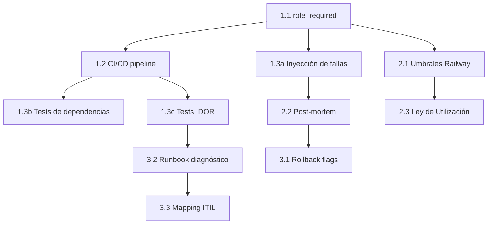

# Plan de Acción — Cumplimiento de Línea de Base EduSync AI

**Origen:** `docs/edu-sync-ai-baseline-compliance.md`
**Propósito:** Implementar los ítems faltantes o parciales para lograr cumplimiento total
**Priorización:** Impacto × Urgencia (basado en la matriz ITIL del propio baseline)

---

## 📋 Leyenda

| Símbolo | Significado |
|---------|-------------|
| 🟢 **P1** | Prioridad 1 — Crítico para seguridad/estabilidad |
| 🟡 **P2** | Prioridad 2 — Alta mejora operativa |
| 🔵 **P3** | Prioridad 3 — Valor añadido / madurez |
| ⚪ **P4** | Prioridad 4 — Bajo esfuerzo, buen tener |

---

## Fase 1 — Cimientos de Seguridad y Automatización (P1)

### 1.1 Decorador `@role_required` centralizado + matriz de permisos

**Origen:** D1 (Privilegio Mínimo) — ⚠️ Parcial
**Impacto:** Elimina verificaciones ad-hoc en 20+ rutas, cierra fugas de permisos
**Esfuerzo:** Bajo (~2h)

```python
# app/middleware/authorization.py
from functools import wraps
from flask import abort, jsonify, request
from app.auth_compat import current_user

# Jerarquía: cada entrada lista los roles a los que ese rol puede acceder
# Ej: admin puede acceder a rutas de admin, supervisor, terapista, etc.
ROLE_HIERARCHY = {
    'admin':      ['admin', 'supervisor', 'terapista', 'operador', 'jugador'],
    'supervisor': ['supervisor', 'terapista', 'operador', 'jugador'],
    'terapista':  ['terapista', 'jugador'],
    'operador':   ['operador'],
    'jugador':    ['jugador'],
}

def role_required(*roles):
    """Verifica que el usuario tenga al menos uno de los roles requeridos.
    Uso: @role_required('admin')  — solo admin
         @role_required('terapista')  — terapista, supervisor y admin
    """
    def decorator(f):
        @wraps(f)
        def wrapper(*args, **kwargs):
            if not current_user.is_authenticated:
                if request.accept_mimetypes.accept_json:
                    return jsonify({'error': 'No autorizado'}), 401
                abort(401)
            # Roles que puede ejercer este usuario según jerarquía
            implied = ROLE_HIERARCHY.get(current_user.role, [])
            if current_user.role not in roles and not any(r in implied for r in roles):
                if request.accept_mimetypes.accept_json:
                    return jsonify({'error': 'Permiso denegado'}), 403
                abort(403)
            return f(*args, **kwargs)
        return wrapper
    return decorator
```

**Tareas:**
1. Crear `app/middleware/authorization.py` con `role_required` y `ROLE_HIERARCHY`
2. Refactorizar rutas críticas para usar `@role_required('admin')` en vez de `if current_user.role != 'admin'`
3. Agregar tests unitarios para cada nivel de jerarquía
4. Documentar la matriz de permisos en `docs/authorization.md`

---

### 1.2 Pipeline CI/CD con GitHub Actions

**Origen:** Monitoreo como Código — ❌ No implementado
**Impacto:** Automatización completa, calidad garantizada en cada PR
**Esfuerzo:** Medio (~4h)

```yaml
# .github/workflows/ci.yml
name: CI
on: [push, pull_request]
jobs:
  test-backend:
    runs-on: ubuntu-latest
    services:
      mysql:
        image: mysql:8.0
        env:
          MYSQL_ROOT_PASSWORD: test
          MYSQL_DATABASE: test
    steps:
      - uses: actions/checkout@v4
      - uses: actions/setup-python@v5
        with:
          python-version: '3.11'
          cache: 'pip'
      - run: pip install -r requirements.txt
      - run: pytest tests/ -v --tb=short
  test-frontend:
    runs-on: ubuntu-latest
    steps:
      - uses: actions/checkout@v4
      - uses: actions/setup-node@v4
        with:
          node-version: '20'
          cache: 'npm'
          cache-dependency-path: edysync/package-lock.json
      - run: npm ci --legacy-peer-deps
        working-directory: edysync
      - run: npx ng build --configuration=production
        working-directory: edysync
      - run: npx playwright install --with-deps
        working-directory: edysync
      - run: npx playwright test
        working-directory: edysync
```

**Tareas:**
1. Crear `.github/workflows/ci.yml` con jobs de backend (pytest) y frontend (build + Playwright)
2. Crear `.github/workflows/deploy.yml` para deploy automático a Railway en push a `main`
3. Agregar status badge al README
4. Configurar Docker layer caching para builds más rápidos

---

### 1.3 Pruebas de Inyección de Fallas y Estrés

**Origen:** D2 — ❌ No implementado
**Impacto:** Validación real de tolerancia a fallos y umbrales de alerta
**Esfuerzo:** Medio (~6h)

**Tareas:**

**1.3a — Pruebas de carga concurrente (`tests/test_load.py`)**

```python
"""Pruebas de inyección de carga y estrés concurrente."""
import concurrent.futures
import time

import pytest
from app.extensions import db
from app.models.incidente import Incidente


class TestConcurrentLoad:
    """Simula 25 req/s en endpoints analíticos."""

    N_REQUESTS = 50
    N_WORKERS = 10

    def test_concurrent_health_check(self, client):
        """25 llamadas concurrentes a /api/health no deben degradar el sistema."""
        def _hit():
            return client.get('/api/health')

        with concurrent.futures.ThreadPoolExecutor(max_workers=self.N_WORKERS) as executor:
            futures = [executor.submit(_hit) for _ in range(self.N_REQUESTS)]
            results = [f.result() for f in concurrent.futures.as_completed(futures)]

        ok_count = sum(1 for r in results if r.status_code in (200, 503))
        assert ok_count == self.N_REQUESTS, f"Solo {ok_count}/{self.N_REQUESTS} respondieron"


class TestConcurrentDBWrites:
    """Inyección de transacciones concurrentes para auditar lock tolerance."""

    def test_concurrent_incident_creation(self, session, test_user):
        """20 therapists crean incidentes simultáneamente — sin deadlock."""

        def _create(i):
            inc = Incidente(
                titulo=f'Load test {i}',
                descripcion=f'Concurrent creation test {i}',
                categoria='SOFTWARE',
                prioridad=3,
                estado='NUEVO',
                user_id=test_user.id,
                evidencia_tipo='MANUAL',
                evidencia_original=f'test-{i}',
            )
            session.add(inc)
            session.commit()
            return inc.id_incidente

        with concurrent.futures.ThreadPoolExecutor(max_workers=10) as ex:
            futures = [ex.submit(_create, i) for i in range(20)]
            ids = [f.result() for f in concurrent.futures.as_completed(futures)]

        assert len(ids) == 20
        assert len(set(ids)) == 20  # Todos distintos, sin colisiones
```

**1.3b — Pruebas de caída de dependencias externas (`tests/test_resilience.py`)**

```python
class TestDependencyFailure:
    """Simula caída de dependencias externas."""

    def test_groq_unavailable_degradation(self, client, monkeypatch):
        """Si Groq está caído, el health reporta degraded pero no crash."""
        monkeypatch.setenv('GROQ_API_KEY', '')
        resp = client.get('/api/health')
        data = resp.get_json()
        assert data['checks']['groq']['status'] == 'missing_key'
        assert data['status'] in ('healthy', 'degraded')  # No debe ser error

    def test_db_timeout_returns_503(self, client, monkeypatch):
        """Si DB no responde, health retorna degraded, no 500."""
        from sqlalchemy import exc
        monkeypatch.setattr(
            'app.routes.health_routes.db.engine.connect',
            lambda: (_ for _ in ()).throw(exc.OperationalError("mock", None, None))
        )
        resp = client.get('/api/health')
        assert resp.status_code in (200, 503)
        data = resp.get_json()
        assert data['checks']['database']['status'] == 'error'
```

**1.3c — Pruebas de IDOR (Insecure Direct Object Reference)**

Agregar al `test_security_integration.py` existente:

```python
class TestIDOR:
    """Paciente A no debe ver datos del paciente B."""

    def test_patient_cannot_access_other_patient(self, client):
        # Login como paciente A
        client.post('/api/login', json={'email': 'patient_a@test.com', 'password': 'x'})
        # Intentar ver datos del paciente B
        resp = client.get('/api/patients/999')
        assert resp.status_code in (401, 403, 404)

    def test_therapist_only_sees_own_patients(self, client):
        """Terapista no debe listar pacientes de otro terapista."""
        # Login como terapista
        client.post('/api/login', json={'email': 'therapist_1@test.com', 'password': 'x'})
        resp = client.get('/api/patients')
        data = resp.get_json()
        if data and 'patients' in data:
            for p in data['patients']:
                assert p.get('assigned_therapist_id') == 1  # therapist_1
```

---

## Fase 2 — Monitoreo y Operaciones (P2)

### 2.1 Umbrales Programáticos CPU/RAM/Disco

**Origen:** B2 — ⚠️ Parcial
**Impacto:** Alertas automáticas cuando los recursos se acercan al límite
**Esfuerzo:** Bajo (~3h)

**Tareas:**

1. **Crear `app/services/railway_metrics_service.py`** que consuma Railway Metrics API:

```python
"""Monitorea métricas de Railway: CPU, RAM, disco."""
import logging
import os
from datetime import datetime, timedelta

import requests

logger = logging.getLogger(__name__)

RAILWAY_API = 'https://backboard.railway.app/graphql/v2'
RAILWAY_TOKEN = os.environ.get('RAILWAY_API_TOKEN', '')
RAILWAY_PROJECT_ID = os.environ.get('RAILWAY_PROJECT_ID', '')
RAILWAY_ENVIRONMENT_ID = os.environ.get('RAILWAY_ENVIRONMENT_ID', '')

THRESHOLDS = {
    'cpu':    {'warning': 70, 'critical': 80},
    'memory': {'warning': 80, 'critical': 90},
    'disk':   {'warning': 80, 'critical': 85},
}


def get_railway_metrics() -> dict:
    """Obtiene métricas de CPU, RAM y disco desde Railway GraphQL API."""
    query = """
    query ($projectId: String!, $environmentId: String!) {
        deployments(projectId: $projectId, environmentId: $environmentId, last: 1) {
            edges {
                node {
                    metrics {
                        cpuUsage
                        memoryUsage
                        diskUsage
                    }
                }
            }
        }
    }
    """
    try:
        resp = requests.post(
            RAILWAY_API,
            json={'query': query, 'variables': {
                'projectId': RAILWAY_PROJECT_ID,
                'environmentId': RAILWAY_ENVIRONMENT_ID,
            }},
            headers={'Authorization': f'Bearer {RAILWAY_TOKEN}'},
            timeout=15,
        )
        data = resp.json()
        # Parsear y retornar métricas
        return data.get('data', {})
    except Exception as e:
        logger.warning('Railway metrics API error: %s', e)
        return {}


def check_thresholds(metrics: dict) -> list[dict]:
    """Evalúa métricas contra umbrales y retorna alertas."""
    alerts = []
    for resource, threshold in THRESHOLDS.items():
        value = metrics.get(resource, 0)
        if value >= threshold['critical']:
            alerts.append({
                'type': f'{resource}_critical',
                'severity': 'critical',
                'value': value,
                'threshold': threshold['critical'],
            })
        elif value >= threshold['warning']:
            alerts.append({
                'type': f'{resource}_warning',
                'severity': 'warning',
                'value': value,
                'threshold': threshold['warning'],
            })
    return alerts
```

2. **Integrar en CrisisMonitor**: agregar chequeo periódico de Railway metrics cada 5 minutos
3. **Agregar tests** simulando respuestas de Railway API con monkeypatch
4. **Documentar umbrales** en `config.py` como variables de entorno:
   - `ALERT_CPU_WARNING=70`, `ALERT_CPU_CRITICAL=80`
   - `ALERT_MEMORY_WARNING=80`, `ALERT_MEMORY_CRITICAL=90`
   - `ALERT_DISK_WARNING=80`, `ALERT_DISK_CRITICAL=85`

---

### 2.2 Ciclo Post-Evento — Reporte Automático

**Origen:** C3 — ⚠️ Parcial
**Impacto:** Cierra el ciclo de incidentes con documentación automática
**Esfuerzo:** Bajo (~2h)

**Tareas:**

1. **Crear `app/services/post_mortem_service.py`**:

```python
"""Genera reporte post-mortem automático al cerrar un incidente."""
from datetime import datetime

from app.extensions import db
from app.models.incidente import Incidente, IncidenteHistorial
from app.services.email_service import EmailService


class PostMortemService:
    @staticmethod
    def generate_report(incidente_id: int) -> dict:
        """Compila un reporte post-mortem estructurado."""
        inc = Incidente.query.get_or_404(incidente_id)
        historial = IncidenteHistorial.query.filter_by(incidente_id=incidente_id).order_by(
            IncidenteHistorial.changed_at
        ).all()

        return {
            'id_incidente': inc.id_incidente,
            'titulo': inc.titulo,
            'categoria': inc.categoria,
            'prioridad': inc.prioridad,
            'tiempo_deteccion': historial[0].changed_at.isoformat() if historial else 'N/A',
            'tiempo_resolucion': inc.fecha_resolucion.isoformat() if inc.fecha_resolucion else 'N/A',
            'duracion_horas': (
                (inc.fecha_resolucion - inc.fecha_creacion).total_seconds() / 3600
                if inc.fecha_resolucion else None
            ),
            'sla_cumplido': inc.fecha_resolucion <= inc.fecha_limite_sla if inc.fecha_resolucion and inc.fecha_limite_sla else None,
            'escalamientos': [
                {
                    'nivel': h.escalamiento_nivel,
                    'fecha': h.changed_at.isoformat(),
                    'comentario': h.comentario,
                }
                for h in historial if h.escalamiento_nivel
            ],
            'lecciones': _generate_lessons(inc, historial),
        }

    @staticmethod
    def send_report(incidente_id: int, admin_email: str):
        report = PostMortemService.generate_report(incidente_id)
        subject = f'[Post-Mortem] Incidente #{incidente_id} — {report["titulo"]}'
        body = _format_report_email(report)
        EmailService.send_notification_email(subject, [admin_email], body)
```

2. **Trigger automático**: en `incident_routes.py`, al cambiar estado a `RESUELTO`, llamar a `PostMortemService`
3. **Verificación 72h post-resolución**: agregar tarea schedule que verifique cero errores críticos nuevos en Sentry después de resolver un incidente

---

### 2.3 Cálculo de Capacidad (Ley de Utilización)

**Origen:** B3 — ❌ No implementado
**Impacto:** Alertas predictivas antes del colapso
**Esfuerzo:** Bajo (~2h)

**Tareas:**

1. **Crear `app/services/capacity_service.py`**:

```python
"""Cálculo de capacidad usando Ley de Utilización: U = λ × S / C"""
import logging
from datetime import timedelta

from app.middleware.metrics_middleware import collector

logger = logging.getLogger(__name__)

# Meta de operación: < 75%
TARGET_UTILIZATION = 0.75
# Núcleos actuales (configurable vía env)
CPU_CORES = int(__import__('os').environ.get('CPU_CORES', '2'))


def calculate_utilization(lambda_rps: float, s_seconds: float, c_cores: int = CPU_CORES) -> float:
    """U = λ × S / C"""
    if c_cores <= 0:
        return float('inf')
    return (lambda_rps * s_seconds) / c_cores


def get_current_utilization() -> dict:
    """Calcula utilización actual basada en métricas del MetricsCollector."""
    snap = collector.get_snapshot()
    latency = snap.get('latency', {})

    results = {}
    for endpoint, lat in latency.items():
        # λ = request_count / uptime_seconds
        uptime = snap.get('uptime_seconds', 1)
        lambda_rps = lat['count'] / max(uptime, 1)
        # S = avg service time in seconds
        s_seconds = lat['avg_ms'] / 1000

        u = calculate_utilization(lambda_rps, s_seconds)
        results[endpoint] = {
            'utilization_pct': round(u * 100, 2),
            'lambda_rps': round(lambda_rps, 2),
            's_seconds': round(s_seconds, 4),
            'status': 'ok' if u < TARGET_UTILIZATION else 'warning' if u < 1.0 else 'critical',
        }

    return results


def get_scaling_recommendation() -> dict:
    """Recomienda escalamiento si la utilización supera el target."""
    utils = get_current_utilization()
    max_u = max((e['utilization_pct'] for e in utils.values()), default=0) / 100

    if max_u < TARGET_UTILIZATION:
        return {'action': 'none', 'current_cores': CPU_CORES}

    # Calcular núcleos necesarios para U <= 75%
    needed_cores = max(CPU_CORES, int((max_u / TARGET_UTILIZATION) * CPU_CORES) + 1)
    return {
        'action': 'scale_up',
        'current_cores': CPU_CORES,
        'recommended_cores': needed_cores,
        'reason': f'U={max_u:.1%} > target={TARGET_UTILIZATION:.0%}',
    }
```

2. **Integrar en CrisisMonitor**: alerta cuando `U >= 75%`
3. **Endpoint `/api/health/capacity`** que exponga el cálculo
4. **Test**: validar que `calculate_utilization(25, 0.12, 2) ≈ 1.50 (150%)`

---

## Fase 3 — Madurez Operativa (P3)

### 3.1 Rollback Automático vía Feature Flags

**Origen:** C2 — ⚠️ Parcial
**Impacto:** Desactivación rápida de módulos problemáticos sin redeploy
**Esfuerzo:** Medio (~4h)

**Tareas:**

1. **Extender `feature_flags.py`** para soportar despliegue canario:

```python
# app/services/feature_flags.py — agregar:
ROLLBACK_TRIGGERS = {
    'healthcheck_500_count': {'threshold': 3, 'window_minutes': 5},
    'login_error_rate': {'threshold': 0.3, 'window_minutes': 5},
}

def auto_disable_on_error(flag_name: str, error_count: int, window_minutes: int = 5):
    """Desactiva automáticamente un feature flag si se detectan muchos errores."""
    if error_count >= ROLLBACK_TRIGGERS.get(flag_name, {}).get('threshold', 5):
        flags = get_flags()
        if flags.get(flag_name, {}).get('enabled', False):
            flags[flag_name]['enabled'] = False
            flags[flag_name]['auto_disabled_at'] = datetime.utcnow().isoformat()
            invalidate_cache()
            logger.warning('🚨 Auto-rollback: flag %s disabled due to %d errors', flag_name, error_count)
            return True
    return False
```

2. **Healthcheck post-deploy automático** en el entrypoint de Railway:
   - Después de deploy, esperar 30s, hacer 3 llamadas a `/api/health`
   - Si fallan todas, Railway automáticamente revierte al deployment anterior
3. **Documentar procedimiento de rollback manual** en `docs/runbooks/rollback.md`:
   - Railway CLI: `railway rollback`
   - Desactivación de feature flag vía variable de entorno `FEATURE_FLAGS`

---

### 3.2 Runbook de Diagnóstico Ejecutable

**Origen:** A2 — ⚠️ Parcial
**Impacto:** Estandariza el diagnóstico sin depender de documentación externa
**Esfuerzo:** Bajo (~1h)

**Tareas:**

1. **Agregar comando CLI `flask diagnose`**:

```python
# app/cli.py o nuevo archivo
import click
from flask.cli import with_appcontext

@app.cli.command('diagnose')
@click.option('--check', default='all', help='Tipo de diagnóstico: db, api, sentry, all')
@with_appcontext
def diagnose_command(check):
    """Ejecuta diagnóstico completo del sistema."""
    from app.extensions import db
    from sqlalchemy import text

    click.echo('🔍 EduSync AI — Diagnóstico del Sistema')
    click.echo('─' * 50)

    if check in ('db', 'all'):
        click.echo('\n📦 Base de Datos:')
        try:
            with db.engine.connect() as conn:
                conn.execute(text('SELECT 1'))
                click.echo('   ✅ Conexión OK')
            # Conexiones activas
            # Tamaño de tablas
            # Última migración
        except Exception as e:
            click.echo(f'   ❌ Error: {e}')

    if check in ('api', 'all'):
        click.echo('\n🌐 API Health:')
        import requests
        try:
            resp = requests.get('http://localhost:8080/api/health', timeout=5)
            click.echo(f'   ✅ Status {resp.status_code}')
            click.echo(f'   {resp.json()}')
        except Exception as e:
            click.echo(f'   ❌ Error: {e}')

    if check in ('sentry', 'all') and os.environ.get('SENTRY_DSN'):
        click.echo('\n🚨 Sentry:')
        click.echo('   ✅ DSN configurado')
        # Últimos eventos
```

2. **Crear `docs/runbooks/diagnostico.md`** con:
   - Pasos del protocolo del baseline (Paso 1, 2, 3)
   - Equivalencia Railway para cada comando
   - Enlace al comando `flask diagnose`

---

### 3.3 Correspondencia Matriz ITIL ↔ Prioridad en Código

**Origen:** A1 — ⚠️ Parcial
**Impacto:** Alineación conceptual entre el documento y la implementación
**Esfuerzo:** Muy bajo (~30min)

**Tareas:**

1. **Agregar mapping en `config.py` o docstring del modelo `Incidente`**:

```python
# app/models/incidente.py
"""
Correspondencia con Matriz ITIL (baseline docs/edu-sync-ai-baseline.md):

Prioridad 1 (Crítica) = Impacto Alto × Urgencia Alta
  → Interrupción total del servicio, 100% usuarios afectados

Prioridad 2 (Alta)    = Impacto Alto × Urgencia Media
                       | Impacto Medio × Urgencia Alta
  → Módulo crítico afectado, workaround posible

Prioridad 3 (Media)   = Impacto Medio × Urgencia Media
                       | Impacto Alto × Urgencia Baja
                       | Impacto Bajo × Urgencia Alta
  → Funcionalidad no crítica, alternativa disponible

Prioridad 4 (Baja)    = Impacto Bajo × Urgencia Media
                       | Impacto Medio × Urgencia Baja
                       | Impacto Bajo × Urgencia Baja
  → Problema cosmético, sin impacto en operaciones
"""
```

---

## Resumen de Esfuerzo

| Fase | Ítem | Esfuerzo | Dependencias |
|------|------|----------|--------------|
| **F1** | 1.1 Decorador `@role_required` | ~2h | — |
| **F1** | 1.2 CI/CD GitHub Actions | ~4h | 1.1 (tests existentes) |
| **F1** | 1.3 Inyección de fallas | ~6h | — |
| **F2** | 2.1 Umbrales CPU/RAM/Disco | ~3h | Railway API token |
| **F2** | 2.2 Reporte post-mortem | ~2h | — |
| **F2** | 2.3 Ley de Utilización | ~2h | 2.1 (MetricsCollector existente) |
| **F3** | 3.1 Rollback automático | ~4h | 1.1 (feature_flags existente) |
| **F3** | 3.2 Runbook de diagnóstico | ~1h | — |
| **F3** | 3.3 Mapping Matriz ITIL | ~0.5h | — |
| | **Total** | **~24.5h** | |

---

## Orden Sugerido de Ejecución



1. 🔴 **1.1** → **1.2** → **1.3** (F1 completa primero — base de seguridad y automatización)
2. 🟡 **2.1** → **2.3** (métricas y capacidad)
3. 🟡 **2.2** → **3.1** (post-mortem y rollback)
4. 🔵 **3.2** → **3.3** (documentación y mapping)

---

## Cómo Empezar

```bash
# 1. Clonar el repo si no lo tienes
cd /home/eduar/proyectos/moscowle_ia

# 2. Leer el compliance report completo
cat docs/edu-sync-ai-baseline-compliance.md

# 3. Iniciar con el ítem 1.1 (máximo impacto, mínimo esfuerzo)
touch app/middleware/authorization.py

# 4. Correr tests existentes para verificar que todo está verde
pytest tests/ -v --tb=short
```
