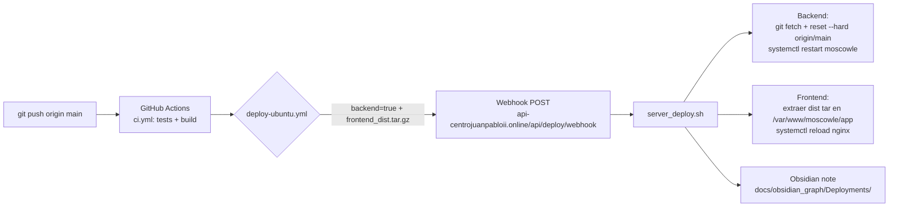

# 🚀 Flujo de Deploy (Auto, sin cPanel)

Objetivo: cada `git push origin main` desplega automáticamente **backend + frontend**
al servidor Ubuntu (`192.168.1.41`) vía el **webhook de deploy**.

## Diagrama

## Piezas

| Pieza | Archivo | Rol |
|---|---|---|
| Webhook backend | `app/routes/deploy_routes.py` | Recibe POST /api/deploy/webhook, valida token, lanza script |
| Script server | `scripts/server_deploy.sh` | pull backend + restart, extrae frontend + reload nginx, escribe nota Obsidian |
| Workflow CI | `.github/workflows/ci.yml` | tests backend + build frontend + `deploy-ubuntu` job |
| Workflow deploy | `.github/workflows/deploy-ubuntu.yml` | trigger backend + package/send dist frontend + smoke test |
| Config | `config.py` → `DEPLOY_WEBHOOK_TOKEN`, `DEPLOY_WEBHOOK_URL` | Secrets para el webhook |

## Secrets de GitHub requeridos

- `DEPLOY_WEBHOOK_URL` = `https://api-centrojuanpabloii.online/api/deploy/webhook`
- `DEPLOY_TOKEN` = mismo valor que `DEPLOY_WEBHOOK_TOKEN` en el `.env` del server

## Qué NO se usa

- ~~cPanel~~ — workflows antiguos eliminados (`deploy-backend.yml`, `deploy-frontend.yml`).
- ~~Railway / Docker~~ — fallback documentado, no es primario.

## Registro de deploys

Cada deploy crea una nota timestamped en [[Deployments]] (ver `docs/obsidian_graph/Deployments/`).
Log del server: `logs/auto_deploy.log`.
